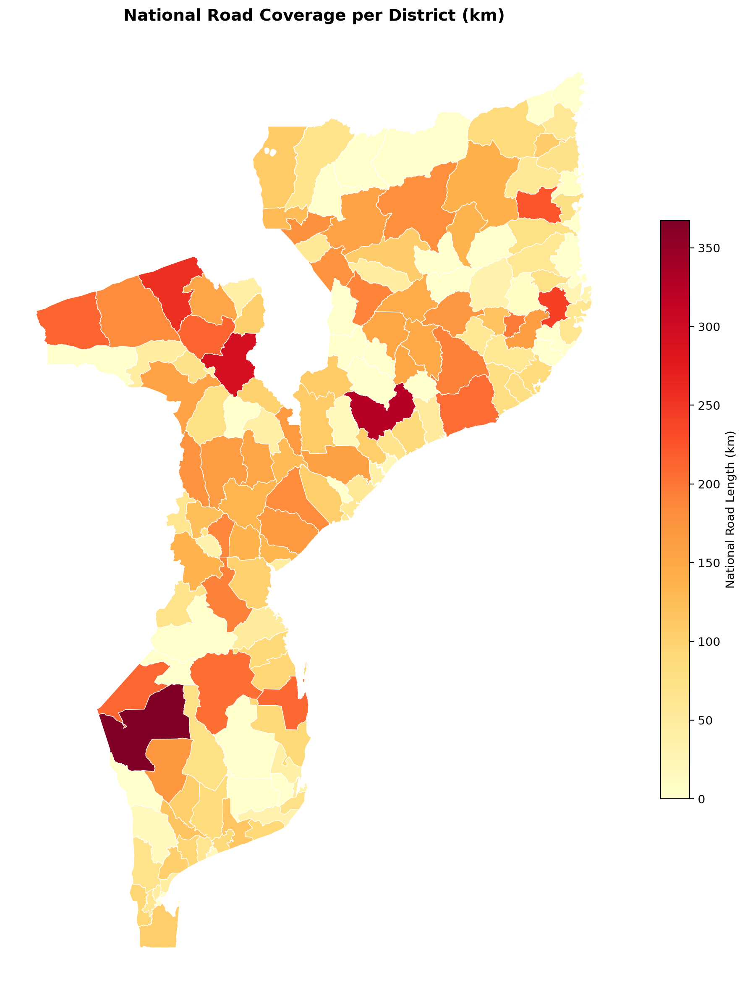

# Mapping National Road Coverage Across Mozambique's Districts

A small, self-contained geospatial analysis that quantifies how much of Mozambique's national road network (N-roads) passes through each administrative district, using GeoPandas.



## What this shows
- Reading and filtering vector layers from a GeoPackage
- Correct CRS handling — reprojecting to UTM Zone 36S (EPSG:32736) for accurate metric length/area calculations
- Spatial joins between road lines and district polygons
- Aggregation and a derived "road density" metric (km of road per km² of district area)
- Cartographic output: overview map, choropleth, ranked bar chart

## Data sources
- Roads: OpenStreetMap Mozambique road network (`gis_osm_roads_free`)
- Boundaries: Mozambique district (adm2) administrative boundaries

## How to run
```bash
pip install -r requirements.txt
jupyter notebook n_roads_analysis.ipynb
```

## Outputs
- `outputs/01_overview_map.png` — district boundaries with national roads overlaid
- `outputs/02_choropleth_road_length.png` — road length per district
- `outputs/03_district_ranking_bar.png` — districts ranked by road coverage
- `outputs/district_road_density.csv` — tabular results (length, area, density per district)

## Possible extensions
- Break out by road class (secondary/tertiary) for a fuller accessibility picture
- Add population data to compute roads-per-capita
- Compare against health facility or market locations for service-area accessibility

---
*Built with [GeoPandas](https://geopandas.org/).*
